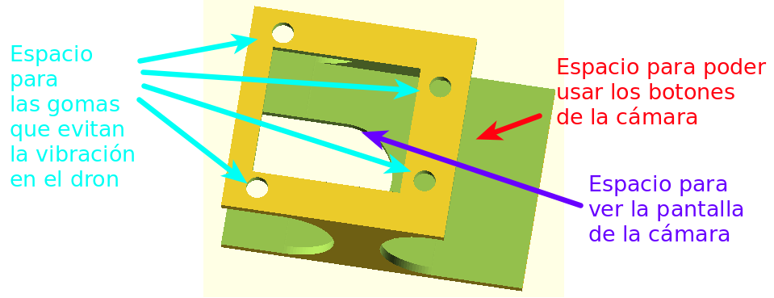
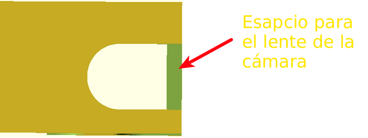
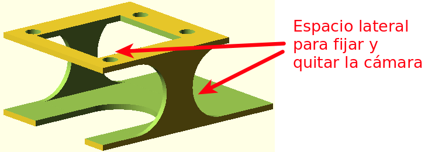

# Porta cámara

Código hecho en [OpenSCAD](http://www.openscad.org/) de un porta cámara (o caja) para el dron [CX-20](https://www.banggood.com/es/Cheerson-CX20-Opensource-Version-AutoPathfinder-Quadcopter-RTF-p-932145.html?cur_warehouse=CN), la cámara digital para la cuál fue hecha es la [nikon coolpix s2800](http://www.nikon.com.mx/nikon-products/product-archive/compact-digital-cameras/coolpix-s2800.html).

Cuenta con los espacios para las gomas que evitan la vibración, espacio para ver la pantalla de la cámara y acceder a los botones.

En la parte inferior tiene espacio para la lente, así es fácil montar la cámara.

Los espacios laterales están hechos de manera que de espacio al material con el que se fijará la cámara a la caja (ligas o cinchos).

## Consideraciones

* Los espacios para las gomas que evitan la vibración pueden hacerse más grandes o chicos dependiendo que tan nuevas (o no) sean dichas gomas.

* Puede modificarse la caja para que sea más alta pero se debe tener cuidado que el lente de la cámara no toque el suelo, cuando todo quede montado en el dron.

* Este porta cámara hace que la lente (de la cámara) *mire* hacia abajo.

Si se imprime *tal cual* el porta cámara se debe tener en cuenta que:

* Para fijar la cámara a la caja, se recomienda usar ligas, cinchos o velcro.
* Para montar la caja al dron puede ayudarse con unas pinzas con punta.
* Para desmontar el porta cámara puede ayudarse de un desarmador (destornillador).
